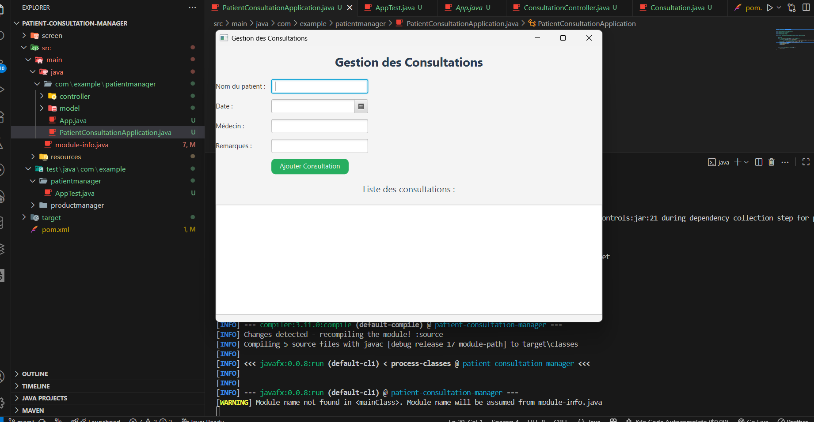

# Patient Consultation Manager

## Description
**Patient Consultation Manager** est une application JavaFX permettant de gérer les consultations des patients dans un cabinet médical ou un centre de santé.  
Elle permet de :  
- Ajouter, modifier et supprimer des patients.  
- Enregistrer les consultations.  
- Visualiser l’historique des consultations.  
- Interface graphique moderne grâce à JavaFX.

---

## Technologies utilisées
- Java 17  
- JavaFX 21  
- Maven pour la gestion des dépendances et le build  
- FXML pour la conception des interfaces  

---

## Structure du projet
```

patient-consultation-manager/
├─ src/
│   ├─ main/
│   │   ├─ java/                 # Code source Java
│   │   │   └─ com/example/patientmanager/
│   │   │       └─ PatientConsultationApplication.java
│   │   └─ resources/            # Ressources (FXML, CSS, images)
│   │       └─ fxml/
│   │           └─ consultation-view\.fxml
└─ pom.xml                       # Configuration Maven

````

---

## Installation et lancement
1. Cloner le projet :  
```bash
git clone <ton-repo-url>
````

2. Aller dans le dossier du projet :

```bash
cd patient-consultation-manager
```

3. Lancer l’application avec Maven :

```bash
mvn clean javafx:run
```

> ⚠️ Assurez-vous que le fichier FXML est bien dans `src/main/resources/fxml/` et que la ressource est référencée correctement dans le code Java.

---

## Fonctionnement

* L’application s’ouvre avec la fenêtre principale affichant les patients.
* Pour chaque patient, vous pouvez ajouter une consultation avec les détails correspondants.
* L’historique des consultations est affiché dans la table principale.

---

## Dépendances Maven

* `org.openjfx:javafx-controls:21`
* `org.openjfx:javafx-fxml:21`

> Les dépendances sont gérées automatiquement via Maven.

---

## Capture d’écran



> Vous pouvez remplacer `docs/demo.png` par la capture d’écran réelle de votre application.

---

## Auteur

* **Ayoub Hilali**
* Email : <ton-email>


